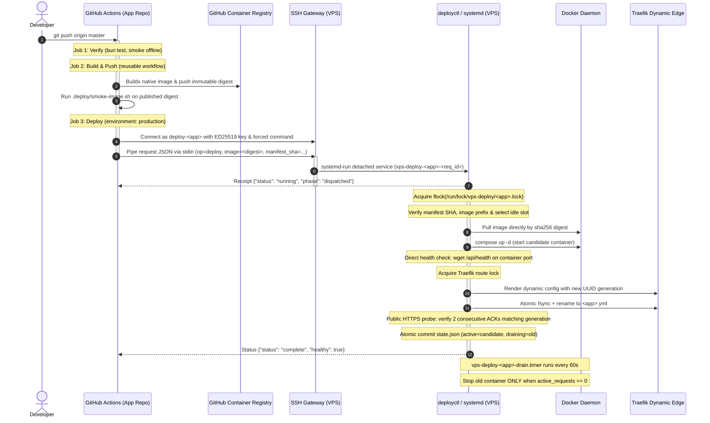

# Shared VPS Deployment Platform (`vps-deploy`)

Hệ thống CI/CD và deployment engine dùng chung trên VPS cho các dịch vụ local/hardened của `TheDemonTuan`. Kiến trúc tách biệt hoàn toàn giữa CI (chỉ có quyền gửi request triển khai bất biến) và Host Engine (thực thi kiểm tra, Blue/Green cutover nguyên tử, xác thực Traefik route và drain zero-downtime).

---

## 1. Luồng hoạt động khi commit code (Deployment Flow)

Khi developer commit và push code lên nhánh mặc định (`master`) của repository ứng dụng (ví dụ `9router`):



### Chi tiết các bước thực thi:

1. **Gate 1 - Regression Verification (`verify`)**:
   - Chạy trên runner GitHub.
   - Cài đặt runtime dependencies và chạy `.deploy/verify.sh` (toàn bộ suite offline, syntax, router, persistence, quota/bypass logic).
2. **Gate 2 - Immutable Build & Smoke (`build`)**:
   - Gọi reusable workflow `TheDemonTuan/vps-deploy/.github/workflows/build-docker.yml@<PINNED_SHA>`.
   - Buildx biên dịch native image trên runner ARM64 (`ubuntu-24.04-arm`).
   - Kiểm tra hợp lệ manifest `.deploy/app.yml` trước khi push.
   - Đẩy image lên GHCR với digest cố định: `ghcr.io/<owner>/<app>@sha256:<64hex>`.
   - Chạy `.deploy/smoke-image.sh` kiểm tra container độc lập: endpoint health, header `no-store`, HTTP/2 h2c, background refresh.
3. **Gate 3 - Restricted Transport Cutover (`deploy`)**:
   - Gắn với GitHub Environment `production` (chỉ nhánh `master` mới được cấp secret).
   - Gọi composite action `TheDemonTuan/vps-deploy/.github/actions/deploy@<PINNED_SHA>`.
   - Kết nối SSH tới VPS user riêng `deploy-<app>` với host key ED25519 được pin cứng.
   - User SSH bị giới hạn bằng `forced command`: chỉ có thể đẩy duy nhất payload JSON vào stdin của wrapper, không có quyền mở interactive shell hay chạy bất kỳ lệnh bash nào khác.
4. **Gate 4 - Host Blue/Green Cutover Engine (`deployctl`)**:
   - Tách thành transient unit systemd (`vps-deploy-<app>-<request_id>.service`) giúp tiến trình deploy hoàn toàn độc lập với phiên SSH; mạng chập chờn hay mất kết nối giữa chừng không làm gãy quá trình cutover.
   - Nhận diện slot nhàn rỗi (ví dụ: `blue` đang chạy thì chọn `green` làm candidate).
   - Kéo image trực tiếp bằng immutable digest (`docker compose pull`).
   - Khởi động candidate (`docker compose up -d --no-deps --pull never <app>-<slot>`).
   - Kiểm tra sức khoẻ trực tiếp (`direct_slot_healthy` qua `/api/health`).
   - Giữ khoá an toàn Traefik (`traefik.lock`), sinh mã UUID generation mới cho route.
   - Ghi cấu hình Traefik candidate ra file tạm `.tmp`, `fsync` đĩa rồi `rename` nguyên tử đè lên dynamic route (`/opt/platform/edge/dynamic/<app>.yml`).
   - Probe HTTPS công khai qua Traefik tới khi nhận đủ **2 lần liên tiếp** HTTP 200 khớp generation header và slot candidate.
   - Ghi nhận trạng thái mới vào `/var/lib/vps-deploy/apps/<app>/state.json`. Slot cũ được đánh dấu `draining`.
5. **Gate 5 - Zero-Downtime Drain & Cleanup**:
   - Slot cũ không bị tắt ép buộc để bảo toàn các kết nối dài (như AI streaming SSE).
   - Systemd timer `vps-deploy-<app>-drain.timer` chạy định kỳ mỗi 60 giây, gọi `deployctl cleanup-drains --app <app>`.
   - Chỉ khi nào slot cũ báo `active_requests == 0` thì container mới được `docker stop`. Container dừng này vẫn được giữ lại làm điểm tựa rollback tức thì (instant rollback mà không cần pull hay build lại).

---

## 2. Hướng dẫn đồng bộ thêm một ứng dụng mới (App Onboarding Guide)

Để đưa một ứng dụng mới (ví dụ `my-service`) vào hệ thống triển khai Blue/Green đồng bộ với quy chuẩn của `9router`, thực hiện theo 3 giai đoạn:

```
[Giai đoạn 1: App Repo]      [Giai đoạn 2: Platform Repo]      [Giai đoạn 3: VPS Host]
.deploy/app.yml               apps/<app>/docker-compose...     User deploy-<app> (restricted)
.deploy/verify.sh             apps/<app>/adapter.sh            /etc/vps-deploy/apps/<app>/
.deploy/smoke-image.sh        Core allowlist update            Drain systemd timer
.github/workflows/deploy.yml
```

### Giai đoạn 1: Chuẩn bị tại Repository ứng dụng mới

1. **Tạo manifest `.deploy/app.yml`**:
   Manifest khai báo các thông số cơ bản, tuyệt đối không chứa secret hay đường dẫn máy chủ:
   ```yaml
   version: 1
   app: my-service
   strategy: blue-green
   image: ghcr.io/thedemontuan/my-service
   platform: linux/arm64
   runtime:
     port: 8080
   health:
     path: /api/health
     timeout_seconds: 60
   route:
     timeout_seconds: 30
   ```

2. **Tạo script kiểm tra cổng chất lượng**:
   - `.deploy/verify.sh`: Chạy test suite nội bộ, linter. Kết thúc exit code 0 nếu đạt.
   - `.deploy/smoke-image.sh`: Nhận `$1` là `$IMAGE_REF`, chạy docker run tạm thời trên runner, kiểm tra curl `/api/health` trả HTTP 200, sau đó dọn dẹp container.

3. **Tạo GitHub Workflow `.github/workflows/deploy.yml`**:
   ```yaml
   name: Build and Deploy

   on:
     push:
       branches: [master, main]
     workflow_dispatch:
       inputs:
         skip_deploy:
           description: "Build image only without deploying to VPS"
           type: boolean
           default: false

   concurrency:
     group: my-service-deploy
     cancel-in-progress: false

   permissions:
     contents: read

   jobs:
     verify:
       name: Regression gates
       runs-on: ubuntu-latest
       timeout-minutes: 10
       steps:
         - uses: actions/checkout@11d5960a326750d5838078e36cf38b85af677262
           with:
             persist-credentials: false
         - name: Run verification script
           run: bash .deploy/verify.sh

     build:
       name: Build and smoke immutable image
       needs: verify
       permissions:
         contents: read
         packages: write
       uses: TheDemonTuan/vps-deploy/.github/workflows/build-docker.yml@<PINNED_PLATFORM_SHA>
       with:
         source-sha: ${{ github.sha }}
         platform-ref: <PINNED_PLATFORM_SHA>
         config: .deploy/app.yml

     deploy:
       name: Deploy immutable digest
       needs: build
       if: github.event_name == 'push' || !inputs.skip_deploy
       runs-on: ubuntu-24.04
       environment: production
       timeout-minutes: 17
       steps:
         - uses: TheDemonTuan/vps-deploy/.github/actions/deploy@<PINNED_PLATFORM_SHA>
           with:
             operation: deploy
             component: app
             source-sha: ${{ github.sha }}
             platform-ref: <PINNED_PLATFORM_SHA>
             config: .deploy/app.yml
             image-ref: ${{ needs.build.outputs.image-ref }}
           env:
             DEPLOY_SSH_KEY: ${{ secrets.DEPLOY_SSH_KEY }}
             DEPLOY_HOST: ${{ vars.DEPLOY_HOST }}
             DEPLOY_PORT: ${{ vars.DEPLOY_PORT }}
             DEPLOY_USER: ${{ vars.DEPLOY_USER }}
   ```

4. **Cấu hình GitHub Environment `production` trên App Repo**:
   - Vào **Settings** -> **Environments** -> **New environment**: đặt tên `production`.
   - **Deployment branches**: Chọn *Selected branches* -> thêm nhánh mặc định (`master` hoặc `main`).
   - **Environment secrets**: Thêm `DEPLOY_SSH_KEY` (khóa private OpenSSH ED25519 cho ứng dụng này).
   - **Environment variables**:
     - `DEPLOY_HOST`: Địa chỉ IP VPS (ví dụ `134.185.89.192`).
     - `DEPLOY_PORT`: Cổng SSH (ví dụ `22`).
     - `DEPLOY_USER`: Tên user riêng (ví dụ `deploy-my-service`).

---

### Giai đoạn 2: Cấu hình trên Platform Repository (`vps-deploy`)

1. **Tạo hồ sơ Compose tại `apps/<app>/docker-compose.prod.yml`**:
   Định nghĩa 2 service `my-service-blue` và `my-service-green`:
   ```yaml
   services:
     my-service-blue:
       image: ${IMAGE_REF}
       container_name: my-service-blue
       restart: unless-stopped
       expose:
         - "8080"
       environment:
         - DEPLOY_SLOT=blue
         - PORT=8080
       networks:
         - edge-my-service
       volumes:
         - my-service-data:/app/data

     my-service-green:
       image: ${IMAGE_REF}
       container_name: my-service-green
       restart: unless-stopped
       expose:
         - "8080"
       environment:
         - DEPLOY_SLOT=green
         - PORT=8080
       networks:
         - edge-my-service
       volumes:
         - my-service-data:/app/data

   networks:
     edge-my-service:
       external: true

   volumes:
     my-service-data:
       name: my-service-data
   ```

2. **Cập nhật allowlist trong core engine (`lib/core.py` và `bin/deployctl`)**:
   - Thêm `<app>` vào danh sách các app được phép xử lý.
   - Thêm prefix repository image `ghcr.io/<owner>/<app>` vào allowlist kiểm tra digest.

3. **Tạo unit helper trong `install/`**:
   - Tạo file wrapper `install/vps-deploy-<app>`:
     ```bash
     #!/bin/sh
     exec /opt/vps-deploy/current/bin/deployctl submit --app <app>
     ```
   - Tạo service & timer drain:
     `vps-deploy-<app>-drain.service` gọi `/opt/vps-deploy/current/bin/deployctl cleanup-drains --app <app>`.
     `vps-deploy-<app>-drain.timer` chạy định kỳ 60s.

---

### Giai đoạn 3: Thiết lập trên máy chủ VPS (Root Operator)

Thực hiện một lần bởi Quản trị viên (Operator) có quyền root:

1. **Tạo cặp khóa SSH và Linux user giới hạn**:
   ```bash
   # Tạo user hệ thống không có mật khẩu, không thuộc nhóm docker
   useradd -r -s /bin/sh -d /var/lib/vps-deploy/home/deploy-my-service -m deploy-my-service
   
   # Sinh khóa ED25519 cho CI (lưu private key để đưa vào GitHub Environment secret)
   ssh-keygen -t ed25519 -N "" -C "deploy-my-service@vps-deploy" -f /root/vps-deploy-my-service
   
   # Cài đặt public key với restriction và forced command
   mkdir -p /var/lib/vps-deploy/home/deploy-my-service/.ssh
   printf 'restrict,command="sudo -n /usr/local/libexec/vps-deploy-my-service" %s\n' \
     "$(cat /root/vps-deploy-my-service.pub)" > /var/lib/vps-deploy/home/deploy-my-service/.ssh/authorized_keys
   chown -R root:root /var/lib/vps-deploy/home/deploy-my-service
   chmod 755 /var/lib/vps-deploy/home/deploy-my-service
   chmod 700 /var/lib/vps-deploy/home/deploy-my-service/.ssh
   chmod 600 /var/lib/vps-deploy/home/deploy-my-service/.ssh/authorized_keys
   ```

2. **Cấu hình sudoers chỉ định đích danh lệnh wrapper**:
   ```bash
   cat <<'EOF' > /etc/sudoers.d/vps-deploy-my-service
   deploy-my-service ALL=(root) NOPASSWD: /usr/local/libexec/vps-deploy-my-service ""
   EOF
   chmod 440 /etc/sudoers.d/vps-deploy-my-service
   visudo -cf /etc/sudoers.d/vps-deploy-my-service
   ```

3. **Cài đặt wrapper thực thi và khởi tạo thư mục state**:
   ```bash
   install -d -m 0755 /usr/local/libexec
   install -m 0755 /opt/vps-deploy/current/install/vps-deploy-my-service /usr/local/libexec/vps-deploy-my-service
   
   install -d -m 0700 /etc/vps-deploy/apps/my-service \
                      /var/lib/vps-deploy/apps/my-service \
                      /var/lib/vps-deploy/apps/my-service/requests
   ```

4. **Tạo runtime env và host configuration**:
   - Tạo `/etc/vps-deploy/apps/my-service/runtime.env` (chứa biến môi trường private, quyền `0600` root:root).
   - Tạo `/etc/vps-deploy/apps/my-service/host.json`:
     ```json
     {
       "platform_ref": "<PINNED_PLATFORM_SHA>",
       "dynamic_dir": "/opt/platform/edge/dynamic",
       "api_host": "my-service.tuannguyenviet.site",
       "compose_project": "my-service",
       "edge_network": "edge-my-service",
       "route_name": "my-service.yml"
     }
     ```

5. **Đăng ký manifest ban đầu & kích hoạt drain timer**:
   ```bash
   # Sao chép manifest từ app commit đã duyệt
   git -C /root/my-service-review show <APP_COMMIT>:.deploy/app.yml > /etc/vps-deploy/apps/my-service/app.yml
   chmod 600 /etc/vps-deploy/apps/my-service/app.yml
   
   # Kích hoạt timer drain tự động
   systemctl enable --now vps-deploy-my-service-drain.timer
   ```

6. **Kiểm tra trạng thái từ xa qua key hạn chế**:
   ```bash
   ssh -i /root/vps-deploy-my-service -o BatchMode=yes -o StrictHostKeyChecking=yes deploy-my-service@127.0.0.1 deployctl
   ```
   Sau khi key hoạt động, đưa private key vào GitHub Environment `production` trên App repo để pipeline tự động triển khai.

---

## 3. Các thao tác vận hành khẩn cấp (Operator Runbook)

Khi cần kiểm tra hoặc xử lý trực tiếp trên VPS với quyền root:

- **Kiểm tra trạng thái triển khai**:
  ```bash
  /opt/vps-deploy/current/bin/deployctl status --app 9router --strict
  ```
- **Xử lý sự cố / khôi phục route sau gián đoạn (`reconcile`)**:
  Nếu deploy bị ngắt giữa chừng và báo `recovery_required`, tuyệt đối không khởi động lại script cũ:
  ```bash
  python3 -c '
  import json, subprocess
  payload = dict(version=1, op="reconcile", app="9router", component="app",
                 request_id="manual-reconcile", platform_ref="<PLATFORM_SHA>",
                 manifest_sha256="<MANIFEST_SHA>", source_sha="<SOURCE_SHA>")
  print(subprocess.run(["/opt/vps-deploy/current/bin/deployctl", "submit"], input=json.dumps(payload), text=True, capture_output=True).stdout)
  '
  ```
- **Chủ động dọn dẹp các slot đang drain**:
  ```bash
  /opt/vps-deploy/current/bin/deployctl cleanup-drains --app 9router
  ```
