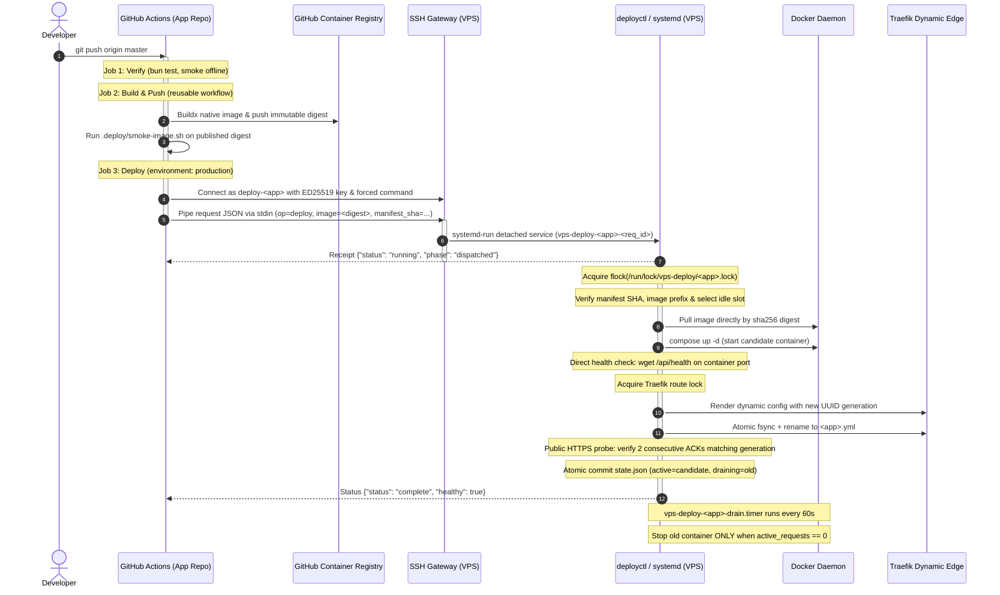

# Shared VPS Deployment Platform (`vps-deploy`)

Hệ thống CI/CD và deployment engine dùng chung trên VPS cho các dịch vụ local/hardened của `TheDemonTuan`. Kiến trúc tách biệt hoàn toàn giữa CI (chỉ có quyền gửi request triển khai bất biến) và Host Engine (thực thi kiểm tra, Blue/Green cutover nguyên tử, xác thực Traefik route và drain zero-downtime).

---

## 1. Luồng hoạt động khi commit code (Deployment Flow)

Khi developer commit và push code lên nhánh mặc định (`master`) của repository ứng dụng (ví dụ `9router`):



### Chi tiết các bước thực thi:

1. **Gate 1 - Regression Verification (`verify`)**:
   - Chạy trên runner GitHub.
   - Cài đặt runtime dependencies và chạy `.deploy/verify.sh` (toàn bộ suite offline, syntax, router, persistence, quota/bypass logic).
2. **Gate 2 - Immutable Build & Smoke (`build`)**:
   - Gọi reusable workflow `TheDemonTuan/vps-deploy/.github/workflows/build-docker.yml@<PINNED_SHA>`.
   - Buildx biên dịch native image trên runner ARM64 (`ubuntu-24.04-arm`).
   - Kiểm tra hợp lệ manifest `.deploy/app.yml` trước khi push.
   - Đẩy image lên GHCR với digest cố định: `ghcr.io/<owner>/<app>@sha256:<64hex>`.
   - Chạy `.deploy/smoke-image.sh` kiểm tra container độc lập: endpoint health, header `no-store`, HTTP/2 h2c, background refresh.
3. **Gate 3 - Restricted Transport Cutover (`deploy`)**:
   - Gắn với GitHub Environment `production` (chỉ nhánh `master` mới được cấp secret).
   - Gọi composite action `TheDemonTuan/vps-deploy/.github/actions/deploy@<PINNED_SHA>`.
   - Kết nối SSH tới VPS user riêng `deploy-<app>` với host key ED25519 được pin cứng.
   - User SSH bị giới hạn bằng `forced command`: chỉ có thể đẩy duy nhất payload JSON vào stdin của wrapper, không có quyền mở interactive shell hay chạy bất kỳ lệnh bash nào khác.
4. **Gate 4 - Host Blue/Green Cutover Engine (`deployctl`)**:
   - Tách thành transient unit systemd (`vps-deploy-<app>-<request_id>.service`) giúp tiến trình deploy hoàn toàn độc lập với phiên SSH; mạng chập chờn hay mất kết nối giữa chừng không làm gãy quá trình cutover.
   - Nhận diện slot nhàn rỗi (ví dụ: `blue` đang chạy thì chọn `green` làm candidate).
   - Kéo image trực tiếp bằng immutable digest (`docker compose pull`).
   - Khởi động candidate (`docker compose up -d --no-deps --pull never <app>-<slot>`).
   - Kiểm tra sức khoẻ trực tiếp (`direct_slot_healthy` qua `/api/health`).
   - Giữ khoá an toàn Traefik (`traefik.lock`), sinh mã UUID generation mới cho route.
   - Ghi cấu hình Traefik candidate ra file tạm `.tmp`, `fsync` đĩa rồi `rename` nguyên tử đè lên dynamic route (`/opt/platform/edge/dynamic/<app>.yml`).
   - Probe HTTPS công khai qua Traefik tới khi nhận đủ **2 lần liên tiếp** HTTP 200 khớp generation header và slot candidate.
   - Ghi nhận trạng thái mới vào `/var/lib/vps-deploy/apps/<app>/state.json`. Slot cũ được đánh dấu `draining`.
5. **Gate 5 - Zero-Downtime Drain & Cleanup**:
   - Slot cũ không bị tắt ép buộc để bảo toàn các kết nối dài (như AI streaming SSE).
   - Systemd timer `vps-deploy-<app>-drain.timer` chạy định kỳ mỗi 60 giây, gọi `deployctl cleanup-drains --app <app>`.
   - Chỉ khi nào slot cũ báo `active_requests == 0` thì container mới được `docker stop`. Container dừng này vẫn được giữ lại làm điểm tựa rollback tức thì (instant rollback mà không cần pull hay build lại).

---

## 2. Hướng dẫn đồng bộ thêm một ứng dụng mới (App Onboarding Guide)

Để đưa một ứng dụng mới (ví dụ `my-service`) vào hệ thống triển khai Blue/Green đồng bộ với quy chuẩn của `9router`, thực hiện theo 3 giai đoạn:

```
[Giai đoạn 1: App Repo]      [Giai đoạn 2: Platform Repo]      [Giai đoạn 3: VPS Host]
.deploy/app.yml               apps/<app>/docker-compose...     User deploy-<app> (restricted)
.deploy/verify.sh             apps/<app>/adapter.sh            /etc/vps-deploy/apps/<app>/
.deploy/smoke-image.sh        Core allowlist update            Drain systemd timer
.github/workflows/deploy.yml
```

### Giai đoạn 1: Chuẩn bị tại Repository ứng dụng mới

1. **Tạo manifest `.deploy/app.yml`**:
   Manifest khai báo các thông số cơ bản, tuyệt đối không chứa secret hay đường dẫn máy chủ:
   ```yaml
   version: 1
   app: my-service
   strategy: blue-green
   image: ghcr.io/thedemontuan/my-service
   platform: linux/arm64
   runtime:
     port: 8080
   health:
     path: /api/health
     timeout_seconds: 60
   route:
     timeout_seconds: 30
   ```

2. **Tạo script kiểm tra cổng chất lượng**:
   - `.deploy/verify.sh`: Chạy test suite nội bộ, linter. Kết thúc exit code 0 nếu đạt.
   - `.deploy/smoke-image.sh`: Nhận `$1` là `$IMAGE_REF`, chạy docker run tạm thời trên runner, kiểm tra curl `/api/health` trả HTTP 200, sau đó dọn dẹp container.

3. **Tạo GitHub Workflow `.github/workflows/deploy.yml`**:
   ```yaml
   name: Build and Deploy

   on:
     push:
       branches: [master, main]
     workflow_dispatch:
       inputs:
         skip_deploy:
           description: "Build image only without deploying to VPS"
           type: boolean
           default: false

   concurrency:
     group: my-service-deploy
     cancel-in-progress: false

   permissions:
     contents: read

   jobs:
     verify:
       name: Regression gates
       runs-on: ubuntu-latest
       timeout-minutes: 10
       steps:
        - uses: actions/checkout@3d3c42e5aac5ba805825da76410c181273ba90b1 # v7.0.1
           with:
             persist-credentials: false
         - name: Run verification script
           run: bash .deploy/verify.sh

     build:
       name: Build and smoke immutable image
       needs: verify
       permissions:
         contents: read
         packages: write
       uses: TheDemonTuan/vps-deploy/.github/workflows/build-docker.yml@<PINNED_PLATFORM_SHA>
       with:
         source-sha: ${{ github.sha }}
         platform-ref: <PINNED_PLATFORM_SHA>
         config: .deploy/app.yml

     deploy:
       name: Deploy immutable digest
       needs: build
       if: github.event_name == 'push' || !inputs.skip_deploy
       runs-on: ubuntu-24.04
       environment: production
       timeout-minutes: 17
       steps:
         - uses: TheDemonTuan/vps-deploy/.github/actions/deploy@<PINNED_PLATFORM_SHA>
           with:
             operation: deploy
             component: app
             source-sha: ${{ github.sha }}
             platform-ref: <PINNED_PLATFORM_SHA>
             config: .deploy/app.yml
             image-ref: ${{ needs.build.outputs.image-ref }}
           env:
             DEPLOY_SSH_KEY: ${{ secrets.DEPLOY_SSH_KEY }}
             DEPLOY_HOST: ${{ vars.DEPLOY_HOST }}
             DEPLOY_PORT: ${{ vars.DEPLOY_PORT }}
             DEPLOY_USER: ${{ vars.DEPLOY_USER }}
   ```

4. **Cấu hình GitHub Environment `production` trên App Repo**:
   - Vào **Settings** -> **Environments** -> **New environment**: đặt tên `production`.
   - **Deployment branches**: Chọn *Selected branches* -> thêm nhánh mặc định (`master` hoặc `main`).
   - **Environment secrets**: Thêm `DEPLOY_SSH_KEY` (khóa private OpenSSH ED25519 cho ứng dụng này).
   - **Environment variables**:
     - `DEPLOY_HOST`: Địa chỉ IP hoặc hostname VPS (lưu trong Environment secret/var, không commit public).
     - `DEPLOY_PORT`: Cổng SSH (ví dụ `22`).
     - `DEPLOY_USER`: Tên user riêng của app (`deploy-<app>`).
---

### Giai đoạn 2: Cấu hình trên Platform Repository (`vps-deploy`)

1. **Tạo hồ sơ Compose tại `apps/<app>/docker-compose.prod.yml`**:
   Định nghĩa 2 service `my-service-blue` và `my-service-green`:
   ```yaml
   services:
     my-service-blue:
       image: ${IMAGE_REF}
       container_name: my-service-blue
       restart: unless-stopped
       expose:
         - "8080"
       environment:
         - DEPLOY_SLOT=blue
         - PORT=8080
       networks:
         - edge-my-service
       volumes:
         - my-service-data:/app/data

     my-service-green:
       image: ${IMAGE_REF}
       container_name: my-service-green
       restart: unless-stopped
       expose:
         - "8080"
       environment:
         - DEPLOY_SLOT=green
         - PORT=8080
       networks:
         - edge-my-service
       volumes:
         - my-service-data:/app/data

   networks:
     edge-my-service:
       external: true

   volumes:
     my-service-data:
       name: my-service-data
   ```

2. **Đăng ký ứng dụng trong `registry/<app>.yml`**:
   Tạo file registry định nghĩa caller repo, nhánh cho phép, manifest policy, runtime env và route:
   ```yaml
   version: 1
   app: my-service
   host: oracle-main
   caller:
     repository: TheDemonTuan/my-service
     ref: refs/heads/master
     refs: [refs/heads/master, refs/heads/main]
     config: .deploy/app.yml
     build_workflows: [deploy.yml]
     deploy_workflows: [deploy.yml]
   manifest:
     version: 1
     app: my-service
     strategy: blue-green
     image: ghcr.io/thedemontuan/my-service
     platform: linux/arm64
     runtime: {port: 8080}
     health: {path: /api/health, timeout_seconds: 60}
     route: {timeout_seconds: 30}
   runtime:
     allowed_env: [PORT, DEPLOY_SLOT]
     required_env: []
   route:
     generation_header: X-My-Service-Route-Generation
     required_middlewares: [deny-internal, security-headers]
   ```

3. **Tạo Traefik adapter tại `apps/<app>/adapter.sh`**:
   Script nhận 5 tham số (`slot`, `generation`, `dashboard_host`, `dashboard_alias_host`, `api_host`) và xuất cấu hình YAML hợp lệ ra stdout.

4. **Cập nhật ánh xạ host tại `hosts/<host>.yml`**:
   Thêm `<app>` vào mục `apps:` của host tương ứng (`route_name`, `api_host`, `work_dir`, `edge_network`...).

### Giai đoạn 3: Thiết lập trên máy chủ VPS (Root Operator)

Thực hiện một lần bởi Quản trị viên (Operator) có quyền root:

1. **Tạo cặp khóa SSH và Linux user giới hạn**:
   ```bash
   # Tạo user hệ thống không có mật khẩu, không thuộc nhóm docker
   useradd -r -s /bin/sh -d /var/lib/vps-deploy/home/deploy-my-service -m deploy-my-service
   
   # Sinh khóa ED25519 cho CI (lưu private key để đưa vào GitHub Environment secret)
   ssh-keygen -t ed25519 -N "" -C "deploy-my-service@vps-deploy" -f /root/vps-deploy-my-service
   
   # Cài đặt public key với restriction và forced command
   mkdir -p /var/lib/vps-deploy/home/deploy-my-service/.ssh
   printf 'restrict,command="sudo -n /usr/local/libexec/vps-deploy-my-service" %s\n' \
     "$(cat /root/vps-deploy-my-service.pub)" > /var/lib/vps-deploy/home/deploy-my-service/.ssh/authorized_keys
   chown -R root:root /var/lib/vps-deploy/home/deploy-my-service
   chmod 755 /var/lib/vps-deploy/home/deploy-my-service
   chmod 700 /var/lib/vps-deploy/home/deploy-my-service/.ssh
   chmod 600 /var/lib/vps-deploy/home/deploy-my-service/.ssh/authorized_keys
   ```

2. **Cấu hình sudoers chỉ định đích danh lệnh wrapper**:
   ```bash
   cat <<'EOF' > /etc/sudoers.d/vps-deploy-my-service
   deploy-my-service ALL=(root) NOPASSWD: /usr/local/libexec/vps-deploy-my-service ""
   EOF
   chmod 440 /etc/sudoers.d/vps-deploy-my-service
   visudo -cf /etc/sudoers.d/vps-deploy-my-service
   ```

3. **Cài đặt wrapper thực thi và khởi tạo thư mục state**:
   ```bash
   install -d -m 0755 /usr/local/libexec
   install -m 0755 /opt/vps-deploy/current/install/vps-deploy-my-service /usr/local/libexec/vps-deploy-my-service
   
   install -d -m 0700 /etc/vps-deploy/apps/my-service \
                      /var/lib/vps-deploy/apps/my-service \
                      /var/lib/vps-deploy/apps/my-service/requests
   ```

4. **Tạo runtime env và host configuration**:
   - Tạo `/etc/vps-deploy/apps/my-service/runtime.env` (chứa biến môi trường private, quyền `0600` root:root).
   - Tạo `/etc/vps-deploy/apps/my-service/host.json`:
     ```json
     {
       "platform_ref": "<PINNED_PLATFORM_SHA>",
       "dynamic_dir": "/opt/platform/edge/dynamic",
       "api_host": "my-service.tuannguyenviet.site",
       "compose_project": "my-service",
       "edge_network": "edge-my-service",
       "route_name": "my-service.yml"
     }
     ```

5. **Đăng ký manifest ban đầu & kích hoạt drain timer**:
   ```bash
   # Sao chép manifest từ app commit đã duyệt
   git -C /root/my-service-review show <APP_COMMIT>:.deploy/app.yml > /etc/vps-deploy/apps/my-service/app.yml
   chmod 600 /etc/vps-deploy/apps/my-service/app.yml
   
   # Kích hoạt timer drain tự động
   systemctl enable --now vps-deploy-my-service-drain.timer
   ```

6. **Kiểm tra trạng thái từ xa qua key hạn chế**:
   ```bash
   ssh -i /root/vps-deploy-my-service -o BatchMode=yes -o StrictHostKeyChecking=yes deploy-my-service@127.0.0.1 deployctl
   ```
   Sau khi key hoạt động, đưa private key vào GitHub Environment `production` trên App repo để pipeline tự động triển khai.


### 4. Thành phần Stateful ChatGPT Web Runtime (`cgw`)

Đối với các ứng dụng có thành phần runtime trình duyệt hoặc stateful harness (như `9router`):
- Runtime được quản lý dưới Compose project riêng biệt `9router-cgw`, container `9router-cgw-runtime`, volume account `9router-cgw-data` và cache trình duyệt `9router-cgw-browser` riêng biệt.
- Runtime chạy non-root (`10001:10001`), `read_only: true`, `cap_drop: [ALL]`, `no-new-privileges: true`, shm 1GB, giới hạn 1 CPU / 2GB RAM và seccomp profile tương thích user-namespace của Chromium. VNC chỉ bind `127.0.0.1:17842`.
- Giao tiếp giữa gateway và runtime đi qua mạng nội bộ cô lập `9router-cgw` (`internal: true`). Runtime sở hữu mạng egress riêng biệt `9router-cgw-egress` để kết nối ra ngoài, không đi qua Traefik edge.
- Triển khai runtime sử dụng transaction riêng biệt với durable fence, kiểm tra `physicalIdle: true`, tạo private SQLite snapshot, và resume an toàn sau khi commit. Gateway blue/green không can thiệp vòng đời runtime.
- Registration của `9router` bao gồm image CGW cố định và caller `chatgpt-web-runtime.yml` trong build/security/deploy allowlists; giữ source gate của `rtk-sidecar.yml`. Caller manifest, mọi `uses` và `platform-ref` phải cutover cùng immutable platform SHA.
- Reusable `build-docker.yml` nhận `component` tùy chọn (`app` mặc định, hoặc `cgw`). `app` giữ Dockerfile, tag/cache và root image smoke hiện tại. `cgw` chỉ dùng `services/chatgpt-web-runtime/Dockerfile`, app-root context, `APP_REVISION=source-sha`, native ARM64 và tag `sha-<source-sha>`; không có input arbitrary Dockerfile/image/component.
- CGW public image không chứa browser. `docker compose up` tự chạy `browser-init` bằng cùng image, non-root, root read-only, 0.5 CPU / 1GB RAM; tải Chrome for Testing `154.0.8037.92` trực tiếp từ Google và xác minh SHA256/provenance trong Docker cache. Không cài Chrome/Python browser installer trên host, không compile/browser builder hoặc COPY payload vào image. Cache mount tại `/opt/cgw-browser`: init RW, runtime RO; executable versioned do từng image sở hữu, giữ các version cũ để rollback. Managed deploy chuẩn bị cache **trước** drain rồi dùng runtime `up --no-deps`; transaction profile/data vẫn giữ nguyên. Build chạy verifier thật trong image sandboxed và COPY duy nhất generated compatibility JSON vào `/opt/cgw/compatibility.json`. Exact published digest phải qua native image/browser smoke và image Trivy gate. `scripts/scan-browser.py` dùng SPDX đọc qua Docker, Grype `0.120.0` theo CPE `google:chrome`, không ignore HIGH/CRITICAL; mỗi lần scan phải chứng minh phát hiện Chrome cũ có lỗ hổng, scanner/database lỗi hoặc thiếu CPE coverage đều fail closed. CI dọn cache/container của chính job, không upload browser/account/runtime state. Offline build evidence không chứng minh account login hay Full readiness. Runbook: [`install/README.md`](install/README.md#first-cgw-enrollment-and-build-proof).
- Gateway CGW env chỉ cho phép URL nội bộ và ba file selectors `CHATGPT_WEB_RUNTIME_TOKEN_FILE`, `CHATGPT_WEB_RUNTIME_ADMIN_TOKEN_FILE`, `CHATGPT_WEB_CLIENT_KEYS_FILE`; không dùng socket env cũ hoặc secrets trực tiếp. `INITIAL_PASSWORD` vẫn bắt buộc; CGW secret-file/native-policy checks chỉ áp dụng khi manifest enroll CGW.

### Lưu ý an toàn cơ sở dữ liệu Blue/Green

Hai slot blue/green dùng chung volume dữ liệu (như SQLite hoặc DB container). Deployment engine hỗ trợ rollback route và container ngay lập tức, nhưng **không rollback dữ liệu đã thay đổi**.

Quy tắc bắt buộc khi có migration DB:
- Mọi thay đổi schema phải backward-compatible (mô hình Expand -> Migrate -> Contract).
- Code phiên bản mới phải chạy được trên schema cũ, hoặc schema mới phải tương thích hoàn toàn với slot phiên bản cũ khi rollback.
- Không chạy migration phá vỡ cấu trúc cũ (destructive migration) trong cùng release chuyển giao.
---

## 3. Các thao tác vận hành khẩn cấp (Operator Runbook)

Khi cần kiểm tra hoặc xử lý trực tiếp trên VPS với quyền root:

- **Kiểm tra trạng thái triển khai**:
  ```bash
  /opt/vps-deploy/current/bin/deployctl status --app 9router --strict
  ```
- **Xử lý sự cố / khôi phục route sau gián đoạn (`reconcile`)**:
  Nếu deploy bị ngắt giữa chừng và báo `recovery_required`, tuyệt đối không khởi động lại script cũ:
  ```bash
  python3 -c '
  import json, subprocess
  payload = dict(version=1, op="reconcile", app="9router", component="app",
                 request_id="manual-reconcile", platform_ref="<PLATFORM_SHA>",
                 manifest_sha256="<MANIFEST_SHA>", source_sha="<SOURCE_SHA>")
  print(subprocess.run(["/opt/vps-deploy/current/bin/deployctl", "submit"], input=json.dumps(payload), text=True, capture_output=True).stdout)
  '
  ```
- **Chủ động dọn dẹp các slot đang drain**:
  ```bash
  /opt/vps-deploy/current/bin/deployctl cleanup-drains --app 9router
  ```

## Cloudflare releases: ACB and uptimeflare

`.github/workflows/cloudflare-deploy.yml` owns Cloudflare deployment. Registered source repositories build and verify immutable artifacts without Cloudflare credentials; this repository verifies successful whole-workflow CI, branch/head eligibility, GitHub ZIP digest, exhaustive SHA256SUMS and manifest identity before executing only platform-owned adapters. No source npm scripts, OpenNext config, Terraform or uploaded deploy scripts run with the token.

- Registry: `cloudflare/registry/{acb,uptimeflare}.json`. Adding an app requires a reviewed registration and trusted adapter, not copying keys into its source repository.
- Central secrets: `CLOUDFLARE_API_TOKEN`, `CLOUDFLARE_ACCOUNT_ID`. Existing uptimeflare values were moved as GitHub sealed-box ciphertext; plaintext was not downloaded. `UPTIMEFLARE_D1_ID` is a central variable fixed to `431a0d2e-6413-4e80-9d27-1ee933f14f05`.
- Runtime rotation envelopes are stored centrally as `UPTIMEFLARE_CF_ACCESS_CLIENT_ID`, `UPTIMEFLARE_CF_ACCESS_CLIENT_SECRET`, `UPTIMEFLARE_BESZEL_ACCESS_CLIENT_ID`, `UPTIMEFLARE_BESZEL_ACCESS_CLIENT_SECRET`, `UPTIMEFLARE_TELEGRAM_BOT_TOKEN`, `UPTIMEFLARE_TELEGRAM_CHAT_ID`. Ordinary releases preserve existing Worker secrets without reading or rewriting these GitHub values.
- Token permissions: account Workers Scripts edit, D1 read and Durable Objects read for uptimeflare. ACB additionally requires zone read and Workers Routes access for `tuannguyenviet.site`; a token that previously deployed uptimeflare is not evidence of these zone permissions.
- Jobs use environment `production`, per-app non-cancelling concurrency and full trusted-controller CI. The five-minute schedule selects successful `push`/`main` artifacts; GitHub schedules can be delayed. Repeated current-SHA publication verifies HTTP and does not upload or switch versions.
- Public source artifact access is proven with the central built-in `GITHUB_TOKEN`. Private source onboarding needs a separately scoped artifact-read credential; no per-app Cloudflare token is required.
- ACB automatic publication remains disabled until owner-browser acceptance and its approved VPS/static-hosting cutover. `bootstrap` creates only unexposed static assets: no routes, public preview or backend/VPS state changes.
- ACB `cutover` first bootstraps the exact verified artifact with no routes, then switches and verifies viewer before bank. Any host/publication failure restores this run's owned route snapshots in reverse order; drift is recorded, never overwritten. An already-exposed Worker cannot be re-bootstrapped by cutover. A successful runner receipt is `pending_owner_acceptance`, not permission to migrate VPS metadata or remove frontend containers. The controller never generates owner-browser proof.
- Workers Routes API confirmation is not HTTP edge readiness. Cutover requires three consecutive exact SHA/plain-text/no-store viewer release responses within a bounded readiness window before the full artifact verifier; HTML/challenge, stale SHA and cacheable identities reset convergence and never pass. `readiness.json` retains only status/MIME/body classifications, not response bodies. The full checksum/security/asset checks still run once after convergence and failures restore owned routes.
- The owner explicitly authorized this ACB migration without automated browser checks and will test the UI themselves. A separate private operator authorization receipt records that waiver; HTTP receipts still do not claim authenticated browser success. Route/API/SSE, checksums, locks and rollback remain required. ACB HTML verification excludes at most one empty, exact-URL, SRI-tagged Web Analytics script with tightly allowlisted attributes; every other HTML byte and all JS/CSS bytes remain exact artifact comparisons, and the summary reports the exclusion. No security policy is changed.
- Static checksum failures report the artifact path, actual/expected byte counts, whether the one allowed beacon was removable, a whitespace-only mismatch classification and allowlisted beacon type classifications. They never print response bodies, beacon payloads, cookies or headers; these diagnostics do not weaken artifact acceptance.
- `restore-routes` consumes the original central cutover run's immutable receipt artifact, including failed runs. It requires a completed main-branch dispatch from this platform's Cloudflare workflow, checks the server ZIP digest and both snapshot hosts/zones, then uses compare-before-write restoration. Use the original run that created the routes, not a retry whose snapshots contain no changes. Worker versions, VPS metadata and databases are not changed. Verify the original VPS frontend is healthy before restoring traffic.
- uptimeflare publishes `uptimeflare_worker` and `uptimeflare-web` as a checked pair. Existing every-minute Cron, exact RemoteChecker namespace and D1 database are read/verified, never migrated or restored. HTTP checks exercise both SHA markers, actual Next HTML/JS/CSS and D1-backed `/api/data`. Candidate failure restores only owned exact prior versions; deployment drift forbids overwrite. Legacy untagged recovery reports prior SHA as unverified.
- Production uptimeflare HTTP verification uses pinned Playwright Chromium with no Cloudflare/GitHub credentials in its environment. It observes actual public HTML and fetches compiled `/_next/static/` assets, `/api/data` and expected SHA markers from the same browser session. Edge-injected analytics/challenge helpers are not application assets. Non-200 navigation, wrong MIME/body/SHA, redirects, missing product scripts and invalid API data still fail; there is no fallback from failed Chromium verification to a looser HTTP claim. The current public baseline must pass before any version upload.

Manual operations run from this repository:

```sh
gh workflow run cloudflare-deploy.yml -R TheDemonTuan/vps-deploy -f app=uptimeflare -f mode=survey
gh workflow run cloudflare-deploy.yml -R TheDemonTuan/vps-deploy -f app=uptimeflare -f mode=check
gh workflow run cloudflare-deploy.yml -R TheDemonTuan/vps-deploy -f app=uptimeflare -f mode=publish -f source_run_id=<successful-source-run>
gh workflow run cloudflare-deploy.yml -R TheDemonTuan/vps-deploy -f app=uptimeflare -f mode=rollback -f sha=<expected-source-sha> -f version_id=<web-uuid> -f monitor_version_id=<monitor-uuid>
gh workflow run cloudflare-deploy.yml -R TheDemonTuan/vps-deploy -f app=acb -f mode=bootstrap -f source_run_id=<successful-source-run>
gh workflow run cloudflare-deploy.yml -R TheDemonTuan/vps-deploy -f app=acb -f mode=cutover -f source_run_id=<successful-source-run>
gh workflow run cloudflare-deploy.yml -R TheDemonTuan/vps-deploy -f app=acb -f mode=restore-routes -f source_run_id=<original-central-cutover-run>
```

Receipts distinguish source validation, upload, active version and public checks; ACB Access redirect checks never claim an authenticated bank-browser SHA. Rollback requires exact registered Worker UUID(s) and matching expected SHA, not latest/list order. Backend rollback never reads or changes these frontend versions.


### Observed acceptance boundary (2026-10-04)

- Central credential-free CI and real source artifact/digest/manifest validation passed. uptimeflare source PR #22 and platform PRs #2–#5 are merged. All eight old source secrets and obsolete source D1/migration variables were removed after central account/infrastructure reads proved the encrypted transfer usable; no live Worker secrets were removed. One-time migration workflows and sealed delivery artifact were removed.
- Read-only central checks confirmed D1 `431a0d2e-6413-4e80-9d27-1ee933f14f05`, namespace `10db02d2c3874aa7b3db1d599cac207c`, every-minute Cron, monitoring version `fd7ce91a-10da-4b85-94ea-fb4e358942f2` and web version `d4eb9307-08ae-4dc1-9d9c-07787a13b9f7`. These legacy versions have no verified source-SHA tag.
- Actual local Chromium HTML, compiled JS/CSS and D1-backed status API passed. Actual central runner Chromium check `37216355307` failed at public navigation with `HTTP_403`. Publication run `37215987679` refused before upload/traffic mutation at its baseline gate. The blocking security rule is not identified; no Cloudflare policy was changed and no response error was suppressed. Actual publish and live rollback remain unaccepted until this runner can pass the public surface.
- ACB Workers Routes access subsequently succeeded: run `37218981819` created both route sets, but cutover failed at public verification. Retry `37220020426` failed because it checked the new artifact SHA against the older bootstrap without publishing it. The original run's route snapshots remain the recovery source; retry snapshots have no changes. Owner-browser acceptance is unavailable because the browser relay extension is not connected. ACB PR #113 remains open: no backend-only metadata migration or frontend-container removal is authorized by unauthenticated runner checks.
- Recovery run `37220725551` passed full central CI and restored both original route snapshots from `37218981819`; its receipt confirms no Worker-version or VPS-metadata change. SSH then confirmed release `8a192a44d270c4f0c313ee1eae62c02c7a44ead5`, gateway/frontend `green`, and healthy frontend/gateway/worker. Public transaction API retained its JSON contract; bank retained its approved Access 302. Viewer static requests and a real managed-browser navigation encounter the existing CrowdSec challenge, so restored public UI rendering is not attested. No security rule was disabled. Corrected future cutover ordering is covered by state-transition regressions, not claimed as a completed production migration.

